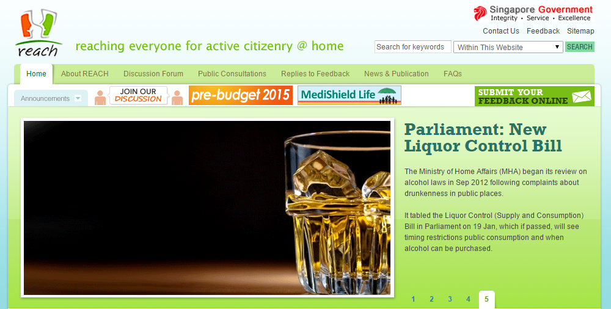
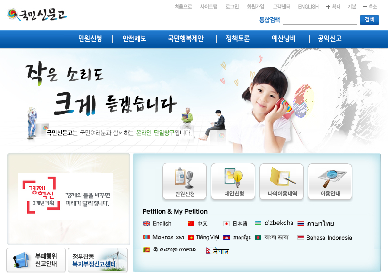
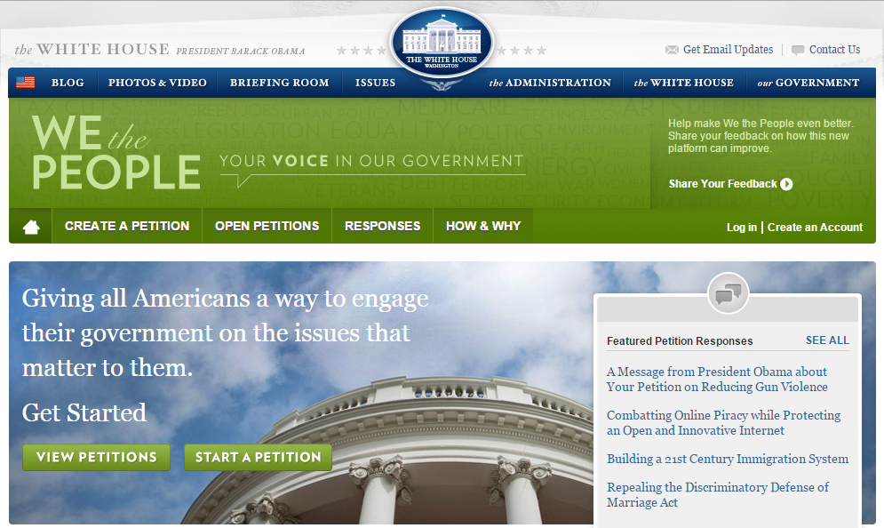
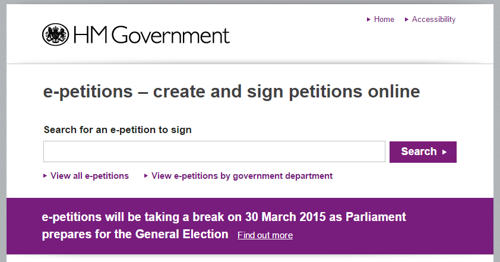

# 公共政策參與

#壹、背景說明
公民參與係民主制度建立與民主深化的重要關鍵，聯合國於1975年發表「公眾參與部門決策」(Popular participation in decision-making for development)報告中指出「公民應有機會參與推動及享有社會發展」。近年來因應資通訊科技的發展，行動網路與社群網路媒體的普及，公民與政府間的關係產生轉變，資訊的可得性與快速擴散性，增加彼此互動，使公民社會中，民眾有更多參與公共政策討論的機會，提高政府對人民的回應性與課責性。
依國家發展委員會103年個人/家戶數位機會調查顯示，我國12歲以上民眾78%有使用網路的經驗，71.4%有行動上網經驗。隨著電腦及上網普及率逐年提升，當愈來愈多民眾透過網站或社群網路媒體討論公眾議題，網路民意資料大量成長，促使政府朝向透明、參與、網路政策溝通方向發展，並開始應用社群網路媒體（Social Network，簡稱Web 2.0）改善與民眾互動及提升公共政策服務。
有鑑於此，因應內、外在環境快速變遷及民眾需求漸趨多元，資訊科技如何應用到民主政治的公民參與機制，政府應善用網路工具與政府開放的概念，建置公共政策網路參與平臺，讓政府政策及計畫在形成、執行及評估等階段，民眾可以透過E參與(e-participation)的管道來實現對公共政策之參與。
#貳、國際發展趨勢
透過網路表達對時事及政府政策的看法，在民主國家已是普遍表達意見的方式。經由網路平臺集結眾人的力量或是意見，亦為現今時下最常使用管道之一，「網路社群」所形成的公民力量，值得政府持續觀察後續帶來的效應。 
誠如美國總統歐巴馬於美國白宮【We the People】請願網所說：「我的政府致力於打造前所未有的開放政府，我們將共同努力，以確保公眾的信任，建立透明、公眾參與和協作的系統。開放性將鞏固我們的民主、提高效率和有力的政府。」
在全球性社會發展環境變遷中，各國政府紛紛採取作為，以開放多元管道，匯聚外部意見，強化公共治理效能。分析國際網路參與之做法，分為公民網路參與和請願連署二種方式，分述如下：
##一、公民網路參與
###(一)[新加坡公民參與平臺 【REACH】](https://www.reach.gov.sg/Home.aspx)

於2006年10月推出，以蒐集公眾意見為主，成為政府機關與民眾互動的平臺。2009年1月，REACH (reaching everyone for active citizenry @ home)正式成為新加坡政府的電子化公民參與平臺。
###(二)[韓國人民線上陳情及討論入口網站【E-People】](http://www.epeople.go.kr/jsp/user/UserMain.jsp) 

該網站成立於2005年，主要目的是提供整合的資訊和服務，以及鼓勵民眾參與政府決策過程的電子化政府單一入口。該網站整併原有網站，分別為民眾陳情(Civil Petition)、線上論壇(Policy Discussion)與保護民眾權利(Corruption Reporting, and Administrative Judgement)，並陸續進行相關系統之整合，於2008年完成整合43個中央部會、246地方政府及14公共機構之機制。
##二、請願連署
###(一)[美國白宮請願網【We the People】](https://petitions.whitehouse.gov/) 

【We the People】於2011年9月成立，提供民眾針對當前政府政策請願的管道，達到連署門檻，政策相關單位將進行審閱，並可獲得正式的官方回應。
###(二)[英國國會電子請願【e-petitions】](http://epetitions.direct.gov.uk/)

英國國會於2011年夏天正式推出電子請願服務 ，目的是提供大眾能夠參與政治的管道。進行請願或參加簽署者，必須是英國國民或生活在英國的居民。於達到一定比例後，提案會進入立法程序。
#參、國內現況與檢討
檢視我國過去及近期公民運用網路參與施政意見之經驗、運作機制等歷程，分述如下：
##一、運用資通訊技術，強化政策溝通、落實政策討論
為增進公民政策參與多元管道，運用資訊及通訊技術，以更貼近民眾方式強化政策參與、溝通及落實政策討論，原行政院研考會於94年起因應民眾政策議題網路參與，於同年6月起規劃建置「國家政策網路智庫 」，並於95年9月上線使用。另為鼓勵全民參與討論政府預定推行或是正在執行中的政策，原行政院研考會(現為國發會)特別規劃建置「[公共政策大家談](http://thinktank.www.gov.tw) 」專區，包括現行政策資訊揭露、研擬中政策的討論、機關預定推行政策或規劃中方案的討論及意見徵詢、重大社會議題的共議。
##二、票選民怨，精進施政作為
98年11月19日行政院召開會議，院長指示針對民眾抱怨事項進行十大民怨票選，以作為後續除弊興利施政作為參考。
經由各部會自行檢討項目、陳情案件分析、輿情報導及民調結果等篩選出主要民怨項目，包括違規拖吊、竊盜詐騙頻傳、食品衛生、房價過高、無障礙設施不足、路面不平擾民、工程噪音、烏龍稅單、就業安全、生活環境等。
##三、透過民意論壇匯集社會理想與聲音
有鑑於臺灣的活力來自民間，為彰顯政府對臺灣未來願景規劃的重視，原行政院研考會於2009年推動「願景2020計畫」，打造一個超越世代、族群、黨派，由下而上地匯集社會理想與聲音的民意論壇-願景2020網路平臺，藉由網路帶動民眾討論「你我的2020」，並委託11 位學者專家分別經營各主題頻道，由頻道主持人設定各主題之願景描述，透過文章發表、線上活動、網路投票、實體座談、網民互動及交流討論等網路經營方式，蒐集資料並撰寫報告書，期望能落實公民參與機制，形塑臺灣2020年的願景。
##四、建構社會網絡增加民眾參與及互動機制
國發會有鑒於政府推動的重大政策，對國家競爭力與民眾福祉的價值有深遠的影響，推動政策有賴全體國民的認同與支持。惟對一般民眾(尤其是年青族群)而言較難接觸或主動關心了解，以至於政策公布推動時，易遭受質疑，為有效利用溝通管道進行說明，除於示範區官網([http://www.fepz.org.tw/](http://www.fepz.org.tw/))公布資訊外，並藉由社會網絡Facebook粉絲專頁 、Youtube 、Flickr 及簡要簡報「懶人包」等，在政策研擬及執行階段增加民眾參與及互動機制，以創新政務推動的模式來推廣政府施政。
##五、建立「網路參與」運作機制
為促進政府公開透明，深化公民參與，運用資通訊科技建立「網路參與」運作機制，已成為政府與民眾互動的重要溝通管道。例如經貿國是會議之具體作法包括：網路論壇、網路直播、網聚活動及輿情分析等，運用既有社群網路平臺蒐集民意，且邀請公眾以共同參與、協作共筆方式進行意見交流，並綜整意見調查結果彙整分享，以回應社會多元意見。
##六、運用網路直播，方便民眾掌握行政院施政訊息
行政院已於103年9月11日於Youtube平臺進行院會後記者會網路直播，以促進各部會能適應直播聊天室的即時回應方式。同時，為方便民眾即時掌握行政院網路直播和活動消息，利用Youtube影音平臺開設「行政院開麥啦」頻道，提供網友訂閱。
#肆、政府作為
面對網路發展，政府將持續以新思維的角度及抱持開放的態度，積極運用網路媒體工具蒐集及掌握民意，了解民眾想法，與網民發展為互信合作夥伴。
綜上，參考前述國際推動經驗及我國已推動之相關措施，政府為集結群眾智慧，廣納多元意見，促進民眾、非政府組織、新媒體網絡與政府共同協作，以建構民眾參與決策制定環境及擴大施政量能，將提供民眾評論公共議題的管道，近期建置「公共政策網路參與平臺」，以傾聽民意、回應民意，進而落實民意，並促使政策(計畫)在形成、執行階段，能夠設立民眾充分參與意見的溝通管道。
原則上，網路參與機制可分階段建置及推動：
##一、提供政策形成前，徵詢各界意見之網路參與管道：
為了突破長期以來政府與民眾之間單向資訊傳遞的情況，網路參與平臺應提供政策諮詢互動園地，除了解民眾的想法與需求外，透過平臺提供部會徵詢民眾意見網路參與管道，讓民眾瞭解政府目前最新的政策內容。以利在政策施行前，獲得與民眾充分溝通的機會，藉由雙向政策理解與溝通，創造行政民主之施政價值。
##二、政策執行中，供各界監督政策及計畫之網路參與管道：
在政府政策執行的過程中，雖然已有立法委員監督政府施政，但在網路資訊發達的今日，未來將於公共政策網路參與平臺開放政府執行中的政策，提供各界監督之管道，提升政策執行品質。
本階段優先公開經貿國是會議共同及多數意見結論之應辦事項追蹤作業執行情形，加強與民眾溝通、互動與回應意見。後續將逐步開放行政院重大計畫，提供民眾能夠實質參與，共同監督政策執行成效。
##三、提供公民提議，徵集群眾智慧，協力擴大施政量能：
提供公民主動參與政治的一個簡單管道，透過政策提議、討論、簽署附議的過程，形成共識，進而請政府具體回應納入政策或評估可行性。