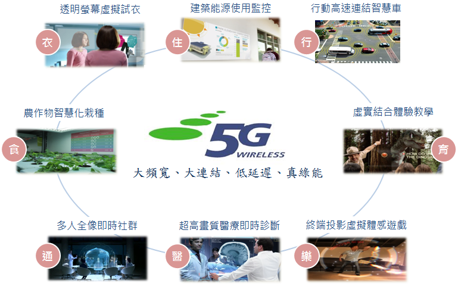

## 如何接軌國際資通標準，以迎接5G智慧網絡時代的新契機?

####隨著人類追求智慧化、便利性與舒適性，隨之帶動提升的資訊傳遞需求與數量激增的智慧終端裝置，將推波助瀾下一世代通訊系統技術的加速發展，預期將對人類的生活再次產生一次重要性的變革。而網絡技術，從2G、3G，發展到現在的4G，2014年底NCC釋出4G頻譜，我國正式走入4G時代，相較之下，國際市場發展更快，4G已在香港、日本、美國、歐洲等地商轉，國際通訊市場已開始關注5G通訊技術，但目前尚未有明確的國際標準產生，為了及早發展取得市場先機，國際間政府、通訊產業致力於發展新的網路技術，為下一代5G網路奠定基礎。 
####可究竟什麼是5G？5G將會給整個社會帶來什麼？您是否已開始想像，人類社會將徹底帶入網絡社會，人與人、物與物、人與物之間的通信，將完美融合科技與人性，您的日常生活將會出現前所未有的智慧與便利。
####在這種全球風行潮流之下，5G發展勢在必行，而在5G時代，無線通行領域將可能不會再出現類似3G時代TD-SCDMA與WCDMA、CDMA2000、WiMax；4G時代的TD-LTE與LTE-FDD的標準之爭，全球5G技術將有望共用一個標準。
####經濟部技術處已輔導成立「台灣資通產業標準協會」，對內建立推動台灣資通技術產業標準制定之平台，對外成為代表台灣對國際組織之單一窗口，邀請業界龍頭華碩電腦曾鏘聲副董事長擔任第一屆理事長，藉由產業自主的整合，為台灣建立技術的標準以及相關智慧財產，讓台灣產業在共通舞台上，成為一個產業鏈並進軍國際，為台灣資通訊產業掌握未來發展契機。
####希望藉由您的寶貴意見，讓政府參考，讓台灣的下世代智慧生活更美好。
