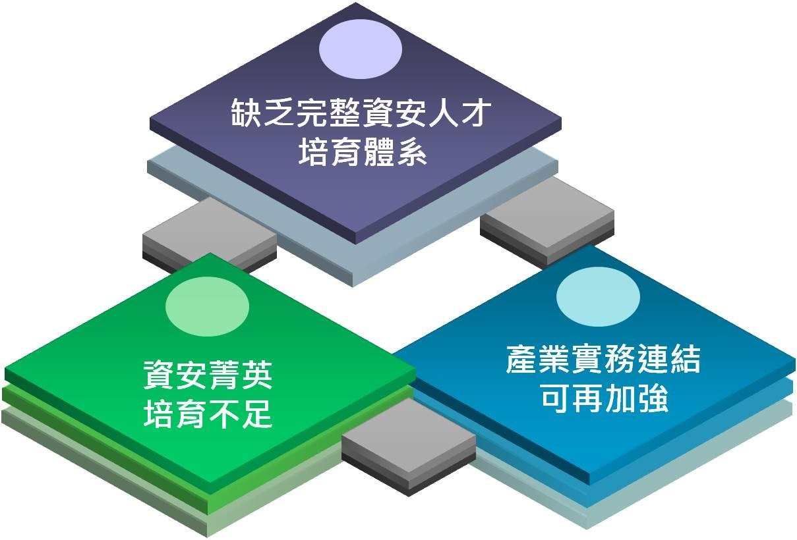

## 如何培育量足質精的資安人才，以確保國家安全及社會穩定?

####先進國家愈來愈重視資安人才之培育與訓練，例如：英國之「政府通訊總部」（GCHQ）授權六所大學提供網路安全碩士學位，訓練新一代的網路間諜和網路安全專家；韓國政府推展 BoB（Best of the Best）菁英計畫，延攬世界頂尖駭客指導韓國的資安菁英；日本行政法人「資訊處理推進機構」（IPA）2004年起舉辦「駭客菁英教育」培育活動，選拔大學生及高中生，培育能夠對抗網站駭客的人才；美國自1993年起舉辦戰備大會(DEF CON)，上萬名好手切磋資安攻防技術，成為國際上最具權威之駭客大賽等，以上為各國擴大資安科研人才培育之具體作法。
####資安專業人才培育不易，且資安威脅不斷演進，資安人員必須隨時充實專業知識以因應新的威脅情勢。政府正思考從「課程」、「平臺」、「競賽」、「實習」及「產學合作」等五大主軸逐步擴大資安科研人才培育，您是否也有一些看法可提供參考?
