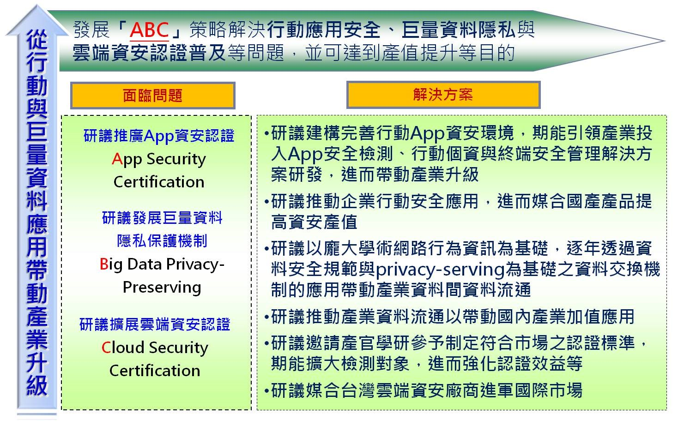

## 如何提升資安自主技術研發能量，厚植資安產業競爭力?

####我國資安產業鏈尚稱完整，包含上游的資安原廠、中游的代理商、經銷商，以及下游直接服務終端用戶的系統整合商、資安顧問公司、資安委外服務供應商、電信業者等眾多經營型態業者。
####目前國內資安服務產業，以資安產品代理、系統整合為主流發展模式，亦有不少廠商經營附加價值更高的資安委外市場，提供如滲透測試、弱點掃瞄、即時監控與事故處理等服務。然就上游資安原廠而言，現階段國內終端用戶所採用的資安產品大部分仍來自海外開發商。
####本土資安業者在技術上的掌握度與國際大廠相比尚具競爭力，反倒是在行銷能力、國際化能力、通路與售後服務方面較不及國際大廠。未來本土資安業者宜加強與學研機構之資安技術研發合作，發展新一代全方位資安整體技術解決方案，積極研究新興資安科技應用及技術標準，掌握雲端、虛擬與行動資安防護等關鍵自主技術，並提升資安威脅整合分析之鉅量資料運算能力，以厚植我國資安產業競爭力。
