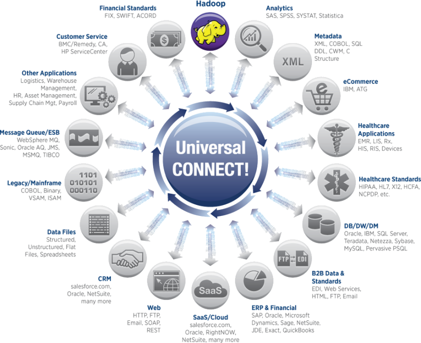

## 如何提升自主技術研發能量，厚植巨量資料產業競爭力？

####巨量資料已是全球資訊科技及服務最重要的方向，全球市場的關注度持續上升，資料世界也正在進行一場有聲有影的革命。國際大廠則是積極與開源軟體進行充份整合，並與現有的解決方案與服務進行介接，強化該領域的整體佈局。

####國內產學研若能共組巨量資料聯盟，匯集來自不同領域研究與發展團隊，並參考國際巨量資料生態圈的發展，從中找出各自最合適的位置，透過「跨領域」的溝通與協作，形成獨特產業聚落，建立產業價值供應鏈，共同創造資料應用市集。

####並在透過積極參與全球開源軟體社群，掌握技術最新動態及未來發展方向，藉由佈局優質專利，將可部分技術創新將透過專利保護之後回饋開源軟體社群，以取得研發成果效益最大化之目的，另外也可與國際大廠共同爭取相比擬的資產與技術的機會。如此一來，國內則以有限的巨量資料軟體人才，發揮最大的產業價值。
####您是否也有一些看法可提供參考？
