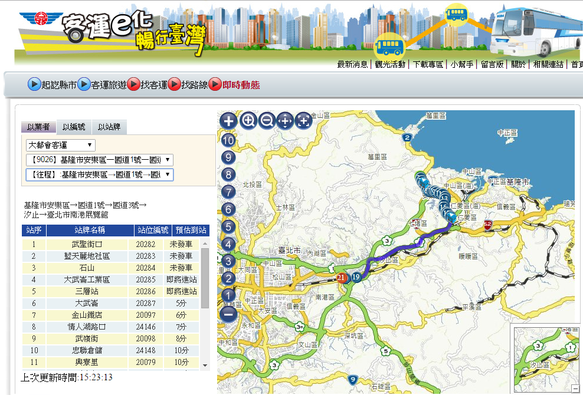

# 智慧運輸
#壹、背景說明
智慧型運輸系統（ITS）係藉由先進的資訊、電子、感測、通訊、控制與管理等科技，將運輸系統內人、車、路所蒐集的資料，經由系統平台處理轉化成合適且有用的資訊，透過通訊系統即時的溝通與連結，改善或強化三者之間的互動關係，提升用路人的交通服務品質與績效，進而增進運輸系統的安全、效率與舒適，同時減少交通環境衝擊。

近年來隨著資訊與通信等技術快速發展，使得許多先進科技運用於改善傳統運輸系統效率的構想日益可行，因此ITS也成為世界各國運輸發展重點之一，期能藉由ITS科技的應用，提升運輸系統運作效率，並有效減少運輸部門能源消耗與溫室氣體的排放。

在我國智慧交通之發展歷程與施政概況部分，主要可以區分為三個主要階段，民國92年以前，為ITS發展啟蒙與奠基時期，強調在9大系統上的基礎研究與應用系統開發，主要的資源投入在於先進交通管理系統(ATMS, Advanced Traffic Management System)、先進公共運輸系統(APTS, Advanced Public Transportation System)、先進用路人資訊系統(ATIS, Advanced Traveler Information System)、電子收付費系統(EPS, Electronic Payment System)及商車營運系統(CVOS, Commercial Vehicle Operation System)等五大領域；第二階段為民國92年到97年階段，配合挑戰2008國家發展重點計畫，推動E化交通專案，在第一階段的研發基礎上，在交通控制、公共運輸及交通資訊服務領域及電子收付費服務等領域推動示範建置；第三階段為民國97年至今，配合智慧台灣-建構智慧交通系統之國家政策，以及網際網路、資通訊技術之發展與應用，國內ITS的發展也邁向了一個新的里程碑，在交通控制管理方面，擴及高快速公路及省道整體路網，在公共運輸服務方面，公車動態資訊將擴及所有市區公車與公路客運，在交通資訊服務方面，以交通服務e網通之發展經驗與系統功能為基礎，逐步以OPEN DATA概念，提供產學各界加值應用，推動交通資訊整合應用服務。

此外，更積極推動高速公路電子收費及多卡通電子票証整合，連結民眾生活需求。從過去國內推動ITS之發展脈絡來觀察，也從強調系統的建置過渡到整合性的智慧運輸服務階段，即時的交通資訊服務與無縫的公共運輸服務成為現階段智慧運輸發展主軸。
#貳、國際趨勢
自1960年代末期，歐洲、日本、美國等國家開始發展智慧型運輸系統，其目的在於藉由科技技術的應用，提升交通運輸系統之服務效益性，增進交通安全、紓解交通壅塞等，而依據各地區之交通環境及社經發展等差異，ITS應用領域也不盡完全相同。

參照聯合國歐洲經濟委員會(UNECE)與聯合國國際資通訊聯盟(ITU)所公布智慧運輸Roadmap相關資料，整合分析國際智慧運輸趨勢三大面向如下：
##一、標準化發展與統一智慧運輸系統規範
智慧運輸系統之相關政府規範制定者與產業界應
(一)加速發展與統一智慧運輸相關車輛、基礎建設與通訊協定等相關規範。

(二)採用與提倡全球統一之相關規範，以加速國際智慧運輸發展。

(三)發展與更新相關智慧運輸規範，重視科技應用帶來可能干擾駕駛人之風險。
##二、優化道路利用與交通資訊蒐集與導引
(一)利用先進資訊科技加強道路資訊偵測與蒐集技術，加強旅行資訊服務，並結合APP等電子傳媒多元傳播，提升運輸資訊供給品質。

(二)優化與提倡複合運輸系統，加強智慧型運輸服務之加值運用，透過大眾運輸動態資訊系統有效車隊監控管理，提升運輸服務品質。

(三)邁向都會區、運輸廊道與城際間空間、時間與資訊無縫之目標。
##三、共享與提倡全球統一之道路設計與車輛生產技術
(一)車內技術(In Vehicle)：透過OBD車機偵測系統(on-board diagnostic systems)與即時資訊技術進行車輛全生命週期評估，持續減少私人運具之一氧化碳、碳氫化合物排放，並加速成熟電動車技術之發展。

(二)車對車技術(Vehicle to Vehicle)與車對設施技術(Vehicle to Infrastructure)：加強先進駕駛人輔助系統(Advanced Driver Assistance Systems ,ADAS)技術之普及，特別是透過無線通訊科技提升車輛間之資訊交換，以達到事故提前預防之目的，如先進緊急自動煞車技術、車道偏移警示系統與先進定速巡航系統等，強化道路安全性、機動性與效率性。

(三)道路安全設計與車輛安全設備：道路規劃應建立與發展標準化設計規範，並納入原諒式道路(forgiving road)設計理念，車輛安全設備應納入人機整合之人性化運作架構，強化車內乘客安全保護設備與系統。

隨著資訊及通訊技術的進步，對於ITS之應用技術也有所提升與改變，於用路人需求面而言，隨著資通技術的發展及智慧型手機之應用，對於智慧型運輸系統之需求及要求亦與過去有所不同。如美國地區性交通單位於90年代即開始對公車之運行進行追蹤，並且藉由網路或SMS之方式提供公車即時到站資訊，例如華盛頓大學所發展之MyBus應用程式，然而該應用程式對於使用者而言並非容易上手，當乘車者於公車站等待時，無法利用站名檢索方式查詢相關到站資訊，且其資訊之表達方式亦較複雜。西雅圖地區的OneBusAway即時到站資訊系統，改善過去公車到站資訊系統的不便性，改以較人性化且具親切性之應用設計方式，以利乘車者查詢；例如在地圖上顯示站位及公車到站時間，乘車者亦可以用公車路線、站位名稱、住址、目的地或下車點之街道名稱等方式查詢相關到站資訊，並且提供不同的應用介面供使用者使用，如適合聽障或視障人士之使用介面等。

另如美國及歐洲公部門所提供之旅行者資訊服務系統（511交通資訊服務），資訊服務提供者可藉由車輛偵測、自動車輛辨識及自動車輛定位等技術來進行行車速率及旅行時間等資料的蒐集，除此之外亦蒐集旅運相關資料、交通事件/緊急事故資料等，經過資料處理及整合運用後，再以適當的方式提供予用路人；部分亦提供自行車、車輛共乘或停車導引、運輸場站等相關資訊。而用路人則可藉由電話、網路、手機應用程式或行動上網之方式查詢相關資訊。

而隨著智慧型手機及行動裝置的普及化，相關應用程式之發展也越來越多元化、應用介面越來越廣，由傳統固定式硬體設施延伸至手機之應用，因此未來交通部門開放資料供第三方應用已成為重要發展趨勢，透過雲端運算（Cloud Computing）及巨量資料（Big Data）分析，以利發展更多創新的應用服務。
#參、國內現況
我國ITS發展從基礎研究、示範系統、服務推廣到目前雲端整合階段，智慧運輸發展核心理念亦從系統、服務到跨域整合，自103年度起第四階段發展定位為「智慧創新」，其中透過智慧運輸服務與資通訊產業技術的創新整合，從民眾生活的角度，提供整合性交通資訊服務，例如「省道即時交通資訊行動化應用軟體」、「公路汽車客運動態資訊管理系統」、「高鐵T EXPRESS APP 營運訊息推播」及「交通服務e網通」，並逐步建立我國智慧運輸服務跨域整合特色。以下將針對交通資訊服務之應用進行簡單介紹：
#一、「省道即時交通資訊行動化應用軟體」
為提供用路人相關即時公路資訊，交通部公路總局建置「省道即時交通資訊網（[http://168.thb.gov.tw/](http://168.thb.gov.tw/)）」，提供網頁資訊服務讓用路人可透過網路瀏覽查詢該局各相關單位交通資訊之蒐集情形，包括影像監視系統（CCTV）、資訊可變標誌（CMS）、車輛偵測器(VD)，結合Google地圖顯示，提供使用者該局轄管道路之即時交通路況。而近年來隨著資通訊技術之發展及個人行動上網裝置（如平板電腦或智慧型手機等）之普及化，越來越多使用者藉由手機應用程式查詢公共運輸資訊；資訊的提供與查詢方式逐漸由傳統固定式的設施延伸至智慧型手機或行動上網裝置的應用，因此發展手機版行動軟體已成為現今的趨勢且為民眾生活中不可或缺之資訊取得途徑之一。

為服務智慧型手機使用者，公路總局於102年2、3月推出「省道即時交通資訊APP（以下簡稱本應用軟體）」Android及iOS版本，讓用路人可利用手機查詢該局各相關單位建置的交通資訊蒐集設備情形，包括影像監視系統（CCTV）、資訊可變標誌（CMS）、車輛偵測器(VD)，結合Google地圖顯示，提供使用者該局轄管道路之即時交通路況；此外，使用者亦可藉由手機定位功能，搜尋鄰近道路的交通資訊蒐集設備（CCTV、CMS）以獲得最新的交通路況及通阻資訊。

而為提供用路人更優質、生活化的服務，該局於103年1月推出本應用軟體（APP）全新改版，並於103年7月再推出「APP推播服務」，增加風景路線績效、交管措施、防災資訊、大客車禁行路段、交通生活資訊、單鍵撥號、交通安全宣導專區及重要訊息推播等多項功能，並完成iOS、Android及windows三種版本APP之開發，協助用路人據本應用軟體（APP）調整行車路線、變更行程，讓旅次規劃更有效率。

使用者可藉由選擇不同區域、風景區路段、易壅塞道路及國道替代道路等功能查詢相關設備及道路績效，並透過交通管制、道路災情、預警性封閉、最新消息及重要訊息推播等資訊，主動獲知相關重要訊息，讓行程規劃更安全、更有效率。此外，增加交通生活資訊專區，提供使用者加油站、停車場、便利商店等生活化資訊，使本應用軟體（APP）更貼近使用者平日生活。
 
##二、「公路汽車客運動態資訊管理系統」
為提升公共運輸服務品質及因應國內整體運輸環境大幅改變，健全公路汽車客運市場經營，加強汽車運輸業管理，協助客運業者進行車隊管理，並提供民眾所需的乘車資訊，交通部公路總局自98年度起推動「公路汽車客運動態資訊管理系統」建置計畫，期望藉由提供詳細之乘車資訊，加強客運業者內部管理並協助政府單位監督管控公路客運運輸，促使運輸服務品質提升，以滿足民眾對運輸服務之需求，降低民眾對私人運具的依賴提高民眾搭乘大眾運輸工具意願。

未來也將透過網路工具技術及跨平台資料庫整合，改善既有運輸系統基礎設施與資訊不足的部分，輔導各地客運業者善用系統後端管理功能，並應用於班車調度、稽查及車機設定管理等內部管理，並協助政府單位監督管控公路客運運輸，以提升各地客運業服務品質及營運效率。

##三、高鐵T EXPRESS APP 營運訊息推播
臺灣高鐵於100年10月推出「T Express 手機快速訂票通關服務」APP，使用者可透過智慧型手機，查詢班次資料及訂購車票，後透過信用卡進行線上付款，並取得 QR Code車票。除此之外，使用電話語音或網站訂購之車票，亦可藉由該APP進行訂購資料之移轉，進行線上付款及取得QR Code車票，以提供更環保便捷之乘車流程。未來，考量即時營運資訊之快速提供，將規劃於高鐵T Express APP中，新增推播功能，結合高鐵官網資訊，平時做為服務及產品訊息傳播工具外，另於天災或營運異常狀況發生時，主動傳遞即時營運變更訊息到已安裝該T Express之民眾手機上，以利旅客安排後續行程。
 
##四、交通服務e網通
為使用路人能夠隨時獲得完整、正確以及即時的交通資訊，交通部運輸研究所於92年度開始著手規劃建置「交通服務e網通」系統，規劃「全國路況資訊中心」、「陸海空客運資訊中心」兩個資料庫，針對各地即時交通路況與公共運輸搭乘兩項與民眾生活息息相關的交通資訊，進行蒐集、整合及提供服務，制定統一的XML資料格式，以免費方式提供加值業者與各研究單位申請做加值應用與研究，以擴大交通資訊之應用層面。目前(至104年1月16日止)申請加值應用家數已累計共238家，使用資料庫類型包括「全國路況」、「各縣市事件資訊」及「陸海空運輸資訊」三類。申請加值單位中政府機關約佔25%，學術應用約佔10%，民間企業約佔65%。

#肆、政府作為
隨著網路技術、資通訊技術與行動通訊應用發展，民眾對於即時交通服務資訊之需求亦日益殷切，如即時道路交通資訊、道路事件資訊及公共運輸服務資訊等，均與民眾生活之旅運需求息息相關，目前各類運輸資訊之來源提供多掌握於縣市政府主管單位及各運具經營者手中，受限於各運具經營單位之發布格式、頻率及品質均不相同，未能納入一致標準，導致相關服務整合為一大難題，必須仰賴大量人力進行資料後處理、資訊整合及資料品質監控等維運工作，導致交通運輸資訊無法完全透通。為因應政府開放資料(OPEN DATA)政策，交通部後續在網路智慧應用服務上，將致力於交通資訊開放資料平臺服務的推動與深化，精進各項資訊標準化、資料品質監控與資訊提供服務面，以持續協助產官學界進行研究與應用服務之開發，主要策略方向為：
##一、整合交通資訊流通服務
針對民眾、加值業者及研究單位之需求，整合精進各類運具之動靜態資訊，建立共通之資料標準格式，並推動交通資料交換平台，以確保資料於接收與發布過程之品質，促進交通資訊有效之傳遞，以及提升資訊之正確性與完整性。
##二、建立資訊服務擴充機制
從公私部門協同營運概念，進行協同合作機制規劃，促進加值業者開發創新服務應用，以提升交通資訊之服務層面，增益資訊服務之多元性。
##三、無縫交通資訊品質精進
為確保來源端交通資訊品質，將促進及擴大交通資訊服務應用之基礎，進行跨區域、跨運具無縫交通資訊實作，以促進各運具搭乘與轉乘之便性，亦有助於提升民眾搭乘公共運輸之意願，並增進運輸系統運作效率。
##四、資料可視化(Data Visualization)應用
針對交通運輸巨量資料，進行可視覺化呈現工具(可結合GIS地圖)之應用，結合民間資源進行工具程式開發，可提供資訊服務擴充應用，亦可結合巨量資料分析提供管理決策支援之用。

