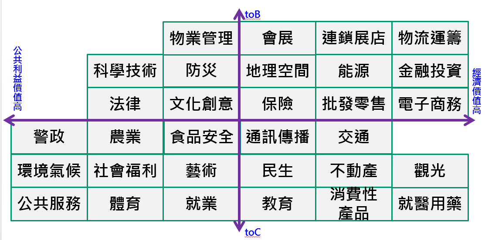

## 我真的需要你

####我們以公共利益、經濟價值、民眾服務及產業發展等面向，架構了包含物業管理、連鎖展店、物流運籌等領域，並以跨部會合作鏈結方式開放領域資料，您覺得還有哪些我們可以探索的領域呢?

####我們將由各機關老闆親自召開政府資料開放諮詢會議，邀請大家一起來挖礦，您覺得您從政府資料可以提煉出什麼服務或應用? 

<iframe width="560" height="315" src="https://www.youtube.com/embed/pB32-0SotQE" frameborder="0" allowfullscreen></iframe>